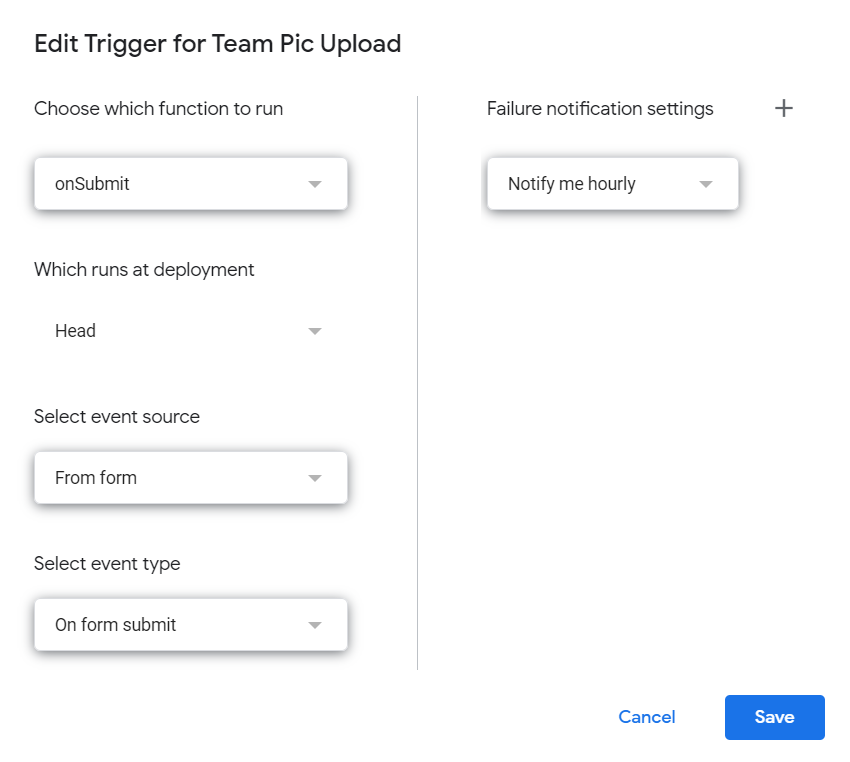

# FRC-Team-Picture-Uploader

A script to take team images from pit scouting, and upload them to a Cloudinary account

## How To Use:
1. Create a google form and click the 3 dots in the upper-right corner
2. Click on "Script editor"
3. Copy and paste "Uploader.gs" into this new file
    * Feel free to name to the file and project
4. **Change all the Cloudinary presets to your own individual presets**
    * **The script will not work without this!**
5. On the left, click the clock icon, the triggers tab
6. On the bottom right, click on "Add Trigger"
7. For the "which function to run" question, select "onSubmit"
8. Head should be fine for "which deployment should run"
    * Note that this means that whenever you make changes to the file, you immediately deploy it
9. For the "event source" question, select "From form"
10. For the "event type" question, select "On form submit"
11. (Optional) You can change the error notification settings if you like
12. The trigger should now look like this, and you can hit "Save" in the bottom right

13. Congrats, you're all set!

## How to customize the script
In your new file, you can change the onSubmit function to look out for different types of data

You can also change the imageUpload function to upload different types of data to Cloudinary